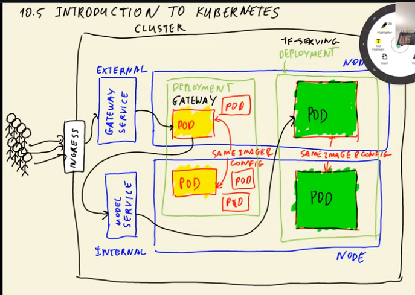

# 10. Kubernetes and TensorFlow Serving

## 10.1 Overview

In this module we will be creating computer vision services using TensorFlow Serving and deploy it on the Kubernates. TF-Serving library is written in C++ and it focuses only on inference, it takes preprocessed input and output the prediction.

The Flask gateway gets the image url from the user through website, it downloads the image, preprocess it and send it to the TF-Serving using gRPC (Remote Procedure Call). Once the TF-Serving returns the prediction on the image, the gateway post-processing the output and send the result back to the website for user.

For Flask gateway can be run only on CPU but for TF-Serving inference we need GPU and because they are two different architecture we can scale them independently.

Things we'll do in this module:

- Convert Keras model for TF-Serving
- Pre and post-processing service with Flask (i.e., gateway)
- Docker compose to communicate two docker services to eachother
- Main concepts of Kubernetes
- Create and setup a local Kubernetes cluster with `Kind` (i.e., kubernetes service to run locally)
- Deploy service on Kubernetes
- Move local kubernetes cluster and deploy it on AWS EKS

## 10.2 TensorFlow Serving

To build the app we need to convert the keras model `HDF5` into special format called tensorflow `SavedModel`. For that we download prebuild model and saved it in the working directory:

```bash
wget https://github.com/alexeygrigorev/mlbookcamp-code/releases/download/chapter7-model/xception_v4_large_08_0.894.h5 -O clothing-model-v4.h5
```

We can look what's inside in the saved model using the utility (saved_model_cli) from tensorflow and the command `saved_model_cli show --dir model-dir-name --all`. Running the command outputs few things but we are interested in the signature, specifically the following one. For instance:

```bash
signature_def['serving_default']:
  The given SavedModel SignatureDef contains the following input(s):
    inputs['input_8'] tensor_info:
        dtype: DT_FLOAT
        shape: (-1, 299, 299, 3)
        name: serving_default_input_8:0
  The given SavedModel SignatureDef contains the following output(s):
    outputs['dense_7'] tensor_info:
        dtype: DT_FLOAT
        shape: (-1, 10)
        name: StatefulPartitionedCall:0
  Method name is: tensorflow/serving/predict
```

We can run the model (`clothing-model`) with the prebuilt docker image `tensorflow/serving:2.7.0`:

```bash
docker run -it --rm \
  -p 8500:8500 \
  -v $(pwd)/clothing-model:/models/clothing-model/1 \
  -e MODEL_NAME="clothing-model" \
  tensorflow/serving:2.7.0
```

- docker run -it --rm (to run the docker)
- -p 8500:8500 (port mapping)
- -v $(pwd)/clothing-model:/models/clothing-model/1 (volumn mapping of *absolute model directory* to *model directory inside the docker image*)
- -e MODEL_NAME="clothing-model" (set environment variable for docker image)
- tensorflow/serving:2.7.0 (name of the image to run)

Tensorflow uses specical serving called `gRPC` protocol which is optimized to use binary data format. We need to convert our prediction into `protobuf`.

## 10.3 Creating a Preprocessing Service

In the previous section we created jupyter notebook to communicates with the model deployed with tensorflow. This notebook fetches an image, pre-process it, turns it into protobuf, sends it to tensorflow-serving, does post-processing, and finally gives a human-readable answer.

In this section we convert the notebook into python script to build flask application. To convert the notebook into script we can run the command `jupyter nbconvert --to script notebook.ipynb` and we rename the script to  `gateway.py`.

Then we create functions to prepare request, send request, and prepare response. For flask app we can reuse the code from session 5:

```python
# Create flask app
app = Flask('gateway')

@app.route('/predict', methods=['POST'])
def predict_endpoint():
    data = request.get_json()
    url = data['url']
    result = predict(url)
    return jsonify(result)
```

Our application has two components: docker container with tensorflow serving and flask application with the gateway.

We also want to put everything in the `pipenv` for deployment. For that we need to install few libraries with pipenv: `pipenv install grpcio==1.42.0 flask gunicorn keras-image-helper`.

As we discussed tensorflow is a large library and we don't want to use it in our application. Instead we can use the following script to convert numpy array into protobuf format and import the `np_to_protobuf` function into our `gateway.py` script. In order the make the script work we need to install the following libraries as well `pipenv install tensorflow-protobuf==2.7.0 protobuf==3.19`:

```python
from tensorflow.core.framework import tensor_pb2, tensor_shape_pb2, types_pb2


def dtypes_as_dtype(dtype):
    if dtype == "float32":
        return types_pb2.DT_FLOAT
    raise Exception("dtype %s is not supported" % dtype)


def make_tensor_proto(data):
    shape = data.shape
    dims = [tensor_shape_pb2.TensorShapeProto.Dim(size=i) for i in shape]
    proto_shape = tensor_shape_pb2.TensorShapeProto(dim=dims)

    proto_dtype = dtypes_as_dtype(data.dtype)

    tensor_proto = tensor_pb2.TensorProto(dtype=proto_dtype, tensor_shape=proto_shape)
    tensor_proto.tensor_content = data.tostring()

    return tensor_proto


def np_to_protobuf(data):
    if data.dtype != "float32":
        data = data.astype("float32")
    return make_tensor_proto(data)
```

**Links**

- Bash script to create custom tf-serving-protobuf and compile: https://github.com/alexeygrigorev/tensorflow-protobuf/blob/main/tf-serving-proto.sh

## 10.4 Running Everything Locally with Docker Compose

Docker Compose is a tool that help us to define and share multi-container applications. With Compose, we can create a YAML file to define the services (in our case it is `gateway` service and `clothing-model` model) and with a single command, we can spin everything up or tear it all down. Docker compose is very useful the test the applications locally.

Instead to mapping the volumn, port, and then running the docker in the terminal for our tf-serving model (clothing-model), we want to create dockker image and put everything in there. For this we want to create docker image by the name `image-model.dockerfile`:

```dockerfile
FROM tensorflow/serving:2.7.0

# Copy model in the image
COPY clothing-model /models/clothing-model/1
# Specify environmental variable
ENV MODEL_NAME="clothing-model"
```

To build the image we also need to specify the dockerfile name along with the tag, for example, `docker build -t clothing-model:xception-v4-001 -f image-model.dockerfile .`

Since we have created the dockerfile to the image we can simply run the image with `docker run -it --rm -p 8500:8500 clothing-model:xception-v4-001`

Similarly we can do the same thing for our gateway service. The file name is `image-gateway.dockerfile`:

```dockerfile
FROM python:3.8.12-slim

RUN pip install pipenv

# Create working directory in docker image
WORKDIR /app

# Copy Pipfile and Pipfile.lock files in working dir
COPY ["Pipfile", "Pipfile.lock", "./"]

# Install required packages using pipenv
RUN pipenv install --system --deploy

# Copy gateway and protobuf scripts in the working dir
COPY ["gateway.py", "protobuf.py", "./"]

EXPOSE 9696

ENTRYPOINT ["gunicorn", "--bind=0.0.0.0:9696", "gateway:app"]
```

Build image: `docker build -t clothing-model-gateway:001 -f image-gateway.dockerfile .`
Run image: `docker run -it --rm -p 9696:9696 clothing-gateway:001`

Upon running these two containers and test for prediction, we should expect connection error. This is because the gateway service is unable to communicate with tf-serving. In order to connect the two containers and work simultaneously we need docker compose. Docker compose require yaml file which will be executed when running the commands from docker compose, usually the file is names as `docker-compose.yaml`:

```yaml
version: "3.9"
services:
  clothing-model: # tf-serving model
    image: clothing-model:xception-v4-001
  gateway: # flask gateway service
    image: clothing-model-gateway:002 # new version
    environment:
      - TF_SERVING_HOST=clothing-model:8500 # look for clothing model and port 8500
    ports: # map host machine with gateway
      - "9696:9696"
```

Now we also need to make slight changes in the `gateway.py` to make the environment variable configurable and assign it to the host. This can be done using `host = os.getenv('TF_SERVING_HOST', 'localhost:8500')`

Running the command `docker-compose up` will establish this connection between both images and everything is configured properly we should have the request predictions.

**Useful commands**

- `docker-compose up`: run docker compose
- `docker-compose up -d`: run docker compose in detached mode
- `docker ps`: to see the running containers
- `docker-compose down`: stop the docker compose

## 10.5 Introduction to Kubernetes

- `Kubernetes` is open source system for automating deployment, scaling and management of containerized applications. It means we can use kubernetes to deploy docker images. These docker images are managed and scaled up by adding more instances when the load increases and scaled down by removing instances when the load decreases.
- `Kubernetes cluster` is a set of nodes that run containerized application.
- `Node` is a server/machine in kubernetes and may be either a virtual or physical machine, depending on the cluster (e.g., laptop or EC2 instance).
- A `kubernetes pod` is a docker container that runs a specific image with specific parameters. Each node can have one or mulitple `pods`, some pods may need more resources than the other.
- We usually group pods with `deployment`. All the pods with in one deployment they have the same docker image. For example, in our case the docker image `clothing-model-gateway:002` will have the pods in one deployment and for the docker image `clothing-model:xception-v4-001` will have pods in other deployment.
- A `kubernetes service` in an entrypoint of an application and it routes requests to pods.
- The service that is visible to client is called `external service` (also called Load Balancer), whereas, the `internal service` (known as ClusterIP) is invisible to the client and it can only be used by pods in the kubernetes clusters.
- `Ingress` routes the requests from client to the external service, typically via HTTPS/HTTP.
- `Horizontal Pod Autoscaler` (HPA) allocates resources depending on demand.
- `Kubernetes configuration` is a yaml file to set configuration for deployment and service for the application. 



Source: [MLZoomcamp](https://github.com/alexeygrigorev/mlbookcamp-code/tree/master/course-zoomcamp)

## 10.6 Deploying a Simple Service to Kubernetes

In this section, we'll deploy a simple web application to a kubernates cluster. For that, we'll implement the following steps:

1. Create a simple ping application in Flask
   - For this, we'll create a directory `ping` and for `pipenv` enironment, we'll also create a seperate `Pipfile` to avoid conflict. Then we need to install `flask` and `gunicorn`.
   - We'll use the app that we built in session 5 by copying `ping.py` and `Dockerfile` with slight changes and then build the image.
    ```python
      # ping.py
      from flask import Flask

      app = Flask('ping-app')

      @app.route('/ping', methods=['GET'])
      def ping():
          return 'PONG'

      if __name__=="__main__":
          app.run(debug=True, host='0.0.0.0', port=9696)
    ```
    ```dockerfile
    # Dockerfile
    FROM python:3.9-slim

    RUN pip install pipenv

    WORKDIR /app

    COPY ["Pipfile", "Pipfile.lock", "./"]

    RUN pipenv install --system --deploy

    COPY "ping.py" .

    EXPOSE 9696

    ENTRYPOINT ["gunicorn", "--bind=0.0.0.0:9696", "ping:app"]
    ```
    - To build the image, we need to specify app name along with the tag, otherwise the local kubernates setup `kind` will cause problems, `docker build -t ping:v001 .`. Now we can run on docker container and on separate terminal use the command `curl localhost:9696/ping` to test the application.
2. Install `kubectl` and `kind` to build and test cluster locally
   - We'll install kubectl from AWS because later we deploy our application on AWS: `curl -o kubectl https://s3.us-west-2.amazonaws.com/amazon-eks/1.24.7/2022-10-31/bin/linux/amd64/kubectl`.
   - To install `kind` to setup local kubernetes setup (executable binaries): `wget https://kind.sigs.k8s.io/dl/v0.17.0/kind-linux-amd64 -O kind` > `chmod +x ./kind`. Once the utility is installed we need to place this into our `$PATH` at our preferred binary installation directory.
3. Setup kubernates cluster and test it
   - First thing we need to do is to create a cluster: `kind create cluster` (default cluster name is kind)
   - Configure kubectl to interact with kind: `kubectl cluster-info --context kind-kind`
   - Check the running services to make sure it works: `kubectl get service`
4. Create a deployment
   - Kubernates requires a lot of configuration and for that VS Code has a [handy extension](https://code.visualstudio.com/docs/azure/kubernetes) that can take a lot of hussle away.
   - Create `deployment.yaml`
      ```yaml
      apiVersion: apps/v1
      kind: Deployment
      metadata: # name of the deployment
        name: ping-deployment
      spec:
        replicas: 1 # number of pods to create
        selector:
          matchLabels: # all pods that have the label app name 'ping' are belonged to 'ping-deployment'
            app: ping
        template: # template of pods (all pods have same configuration)
          metadata:
            labels: # each app gets the same label (i.e., ping in our case)
              app: ping
          spec:
            containers: # name of the container
            - name: ping-pod
              image: ping:v001 # docker image with tag
              resources:
                limits:
                  memory: "128Mi"
                  cpu: "500m"
              ports:
              - containerPort: 9696 # port to expose
      ```
       - We can now apply the `deployment.yaml` to our kubernetes cluster: `kubectl apply -f deployment.yaml`
       - Next we need to load the docker image into our cluster: `kind load docker-image ping:v001`
       - Excuting the command `kubectl get pod` should give the pod status running.
       - To test the pod by specifying the ports: `kubectl port-forward pod-name 9696:9696` and execute `curl localhost:9696/ping` to get the response.
5. Create service for deployment
   - Create `service.yaml`
      ```yaml
      apiVersion: v1
      kind: Service
      metadata: # name of the service ('ping')
        name: ping
      spec:
        type: LoadBalancer # type of the service (external in this case)
        selector: # which pods qualify for forwarding requests
          app: ping
        ports:
        - port: 80 # port of the service
          targetPort: 9696 # port of the pod
      ```
      - Apply `service.yaml`: `kubectl apply -f service.yaml`
      - Running `kubectl get service` will give us the list of external and internal services along with their *service type* and other information.
      - Test the service by port forwarding and specifying the ports: `kubectl port-forward service/ping 8080:80` (using 8080 instead to avoid permission requirement) and executing `curl localhost:8080/ping` should give us the output PONG.

## 10.7 Deploying TensorFlow Models to Kubernetes

In this section we'll deploy tf-serving model to kubernetes. In order to do that we'll create a separate folder `kube-config` and implement the following steps:

- Create deployment for the tf-serving model `model-deployment.yaml`:
  - ```yaml
    apiVersion: apps/v1
    kind: Deployment
    metadata:
      name: tf-serving-clothing-model
    spec:
      replicas: 1
      selector:
        matchLabels:
          app: tf-serving-clothing-model
      template:
        metadata:
          labels:
            app: tf-serving-clothing-model
        spec:
          containers:
          - name: tf-serving-clothing-model
            image: clothing-model:xception-v4-001
            resources:
              limits:
                memory: "512Mi"
                cpu: "0.5"
            ports:
            - containerPort: 8500
    ```
  - Load the model image to kind: `kind load docker-image clothing-model:xception-v4-001`
  - Create model deployment: `kubectl apply -f model-deployment.yaml`
  - Get the running pod id for the model: `kubectl get pod`
  - Test the model deployment using the pod id: `kubectl port-forword tf-serving-clothing-model-85cd6dsb6-rfvg410m 8500:8500` and run `gateway.py` script to get the predictions.
- Create service of tf-serving model `model-service.yaml`:
  - ```yaml
    apiVersion: v1
    kind: Service
    metadata:
      name: tf-serving-clothing-model
    spec:
      type: ClusterIP # default service type is always ClusterIP (i.e., internal service)
      selector:
        app: tf-serving-clothing-model
      ports:
      - port: 8500
        targetPort: 8500
    ```
  - Create model service: `kubectl apply -f mdoel-service.yaml`
  - Check the model service: `kubectl get service`.
  - Test the model service: `kubectl port-forward service/tf-serving-clothing-model 8500:8500` and run `gateway.py` for predictions.
- Create deployment for the gateway `gateway-deployment.yaml`:
  - ```yaml
    apiVersion: apps/v1
    kind: Deployment
    metadata:
      name: gateway
    spec:
      selector:
        matchLabels:
          app: gateway
      template:
        metadata:
          labels:
            app: gateway
        spec:
          containers:
          - name: gateway
            image: clothing-model-gateway:002
            resources:
              limits:
                memory: "128Mi"
                cpu: "100m"
            ports:
            - containerPort: 9696
            env: # set the enivornment variable for model
              - name: TF_SERVING_HOST
                value: tf-serving-clothing-model.default.svc.cluster.local:8500 # kubernates naming convention
    ```
  - Load the gateway image to kind: `kind load docker-image clothing-model-gateway:002`
  - Create gateway deployment `kubectl apply -f gateway-deployment.yaml` and get the running pod id `kubectl get pod`
  - Test the gateway pod: `kubectl port-forward gateway-6b945f541-9gptfd 9696:9696` and execute `test.py` for get predictions.
- Create service of tf-serving model `gateway-service.yaml`:
  - ```yaml
    apiVersion: v1
    kind: Service
    metadata:
      name: gateway
    spec:
      type: LoadBalancer # External service to communicate with client (i.e., LoadBalancer)
      selector:
        app: gateway
      ports:
      - port: 80 # port of the service
        targetPort: 9696 # port of load balancer
    ```
  - Create gateway service: `kubectl apply -f gateway-service.yaml`
  - Get service id: `kubectl get service`
  - Test the gateway service: `kubectl port-forward service/gateway 8080:80` and replace the url on `test.py` to 8080 to get predictions.

**Links**

- Article to come over load balancing problem in production: https://kubernetes.io/blog/2018/11/07/grpc-load-balancing-on-kubernetes-without-tears/

## 10.8 Deploying to EKS

In the section we'll create Elastic Kubernetes Service (EKS) cluster on Amazon using cli, publishing the image to ECR and configure kubectl.

To create cluster and manage on EKS we'll use a cli tool `eksctl` which can be downloaded from [here](https://docs.aws.amazon.com/eks/latest/userguide/eksctl.html). And next we'll follow these steps:

- In the `kube-config` folder create eks config file `eks-config.yaml`:
  - ```yaml
    apiVersion: eksctl.io/v1alpha5
    kind: ClusterConfig

    metadata:
      name: mlzoomcamp-eks
      region: ap-south-1

    nodeGroups: # for our case, we need only one node group (CPU)
      - name: ng-m5-xlarge
        instanceType: m5.xlarge
        desiredCapacity: 1
    ```
  - Create eks cluster: `eksctl create cluster -f eks-config.yaml`
- Publish local docker images to ECR:
  - Create aws ecr repository for eks cluster: `aws ecr create-repository --repository-name mlzoomcamp-images`
  - Bash commands to run in the teminal to push docker images to ecr repository:
    - ```bash
      # Registry URI
      ACCOUNT_ID=22782589
      REGION=ap-south-123
      REGISTRY_NAME=mlzoomcamp-images
      PREFIX=${ACCOUNT_ID}.dkr.ecr.${REGION}.amazonaws.com/${REGISTRY_NAME}

      # Tag local docker images to remote tag
      GATEWAY_LOCAL=clothing-model-gateway:002 # gateway service
      GATEWAY_REMOTE=${PREFIX}:clothing-model-gateway-002 # notice the ':' is replaced with '-' before 002
      docker tag ${GATEWAY_LOCAL} ${GATEWAY_REMOTE}

      MODEL_LOCAL=clothing-model:xception-v4-001 # tf-serving model
      MODEL_REMOTE=${PREFIX}:clothing-model-xception-v4-001 # same thing ':' is replaced with '-' before xception
      docker tag ${MODEL_LOCAL} ${MODEL_REMOTE}


      # Push tagged docker images
      docker push ${MODEL_REMOTE}
      docker push ${GATEWAY_REMOTE}
      ```
    - Login to ecr and push images: `$(aws ecr get-login --no-include-email)`, first push the model and then gateway remote image.
    - Get the uri of these images `echo ${MODEL_REMOTE}` and `echo ${GATEWAY_REMOTE}` and add them to `model-deployment.yaml` and `gate-deployment.yaml` respectively.
  - Apply all the yaml config files to remote node coming from eks (`kubectl get nodes`):
    - `kubectl apply -f model-deployment.yaml`
    - `kubectl apply -f model-service.yaml`
    - `kubectl apply -f gateway-deployment.yaml`
    - `kubectl apply -f gateway-service.yaml`
      - Testing the deployment pods and services should give us predictions.
  - Executing `kubectl get service` should give us the *external port* address which need to add in the `test.py` as access url for predictions (e.g., `url = 'http://a3399e***-5180***.ap-south-123.elb.amazonaws.com/predict'`).

- To delete the remote cluster: `eksctl delete cluster --name mlzoomcamp-eks`

## 10.9 Summary

In the session 10 we covered the following concepts:

- TF-Serving is a system for deploying TensorFlow models
- When using TF-Serving, we need a component for pre-processing
- Kubernetes is a container orchestration platform
- To deploy something on Kubernetes, we need to specify a deployment and a service
- You can use Docker compose and Kind for local experiments

## 10.10 Explore More

- Other local Kubernetes: minikube, k3d, k3s, microk8s, EKS Anywhere
- [Rancher desktop](https://rancherdesktop.io/)
- [Docker desktop](https://www.docker.com/products/docker-desktop/)
- [Lens](https://k8slens.dev/)
- Many cloud providers have Kubernetes: GCP, Azure, Digital ocean and others. Look for "Managed Kubernetes" in your favourite search engine
- Deploy the model from previous modules and from your project with Kubernetes
- Learn about Kubernetes namespaces. Here we used the default namespace

## Command References Used in the Session 10

```bash
# tensorflow utility to explore tf SavedModel
saved_model_cli


# run tf-serving model locally on terminal using docker (have to provide full path hence $(pwd))
docker run -it --rm \
  -p 8500:8500 \
  -v $(pwd)/clothing-model:/models/clothing-model/1 \
  -e MODEL_NAME="clothing-model" \
  tensorflow/serving:2.7.0

# build docker image for tf-serving model with '.dockerfile'
docker build -t clothing-model:xception-v4-001 \
  -f image-model.dockerfile .

# run docker container of tf-serving model on port 8500
docker run -it --rm \
  -p 8500:8500 \
  clothing-model:xception-v4-001

# build docker image for flask gateway service with '.dockerfile'
docker build -t clothing-model-gateway:002 \
  -f image-gateway.dockerfile .

# run docker container of gateway service on port 9696
docker run -it --rm \
  -p 9696:9696 \
  clothing-model-gateway:002


# run docker compose
docker-compose up
# run docker compose in detach mode
docker-compose up -d
# stop docker compose
docker-compose down


# create simple app (ping) with port 9696
docker build -t ping:v001 .
docker run -it --rm -p 9696:9696 ping:v001

# create local kubernetes cluster
kind create cluster

# Check the status/info of the cluster
kubectl cluster-info

# list all pods in the namespace
kubectl get pod
# list all deployments
kubectl get deployment
# list all services
kubectl get service
# list all nodes
kubectl get nodes
# see the logs of a running pod
kubectl logs ping-deployment-7df687f8cd-tfkgd

# create deployment for simple app (ping)
kubectl apply -f deployment.yaml
# load docker image of app (ping) to kind
kind load docker-image ping:v001
# test 'ping app' deployment
kubectl port-forward ping-deployment-7df687f8cd-tfkgd 9696:9696

# create service for simple app (ping)
kubectl apply -f service.yaml
# test 'ping app' service
kubectl port-forward service/ping 8080:80 # port 8080 (for host machine) instead of 80 to avoid permission issues

# to delete any yaml configuration file
kubectl delete -f filename.yaml


# load tf-serving model image to kind
kind load docker-image clothing-model:xception-v4-001
# create tf-serving model deployment
kubectl apply -f model-deployment.yaml
# test tf-serving model deployment
kubectl port-forward tf-serving-clothing-model-85cd4b7fc9-rntfw 8500:8500

# create service for tf-serving
kubectl apply -f model-service.yaml
# test tf-serving service
kubectl port-forward service/tf-serving-clothing-model 8500:8500


# load gateway image to kind
kind load docker-image clothing-model-gateway:002
# create gateway deployment
kubectl apply -f gateway-deployment.yaml
# test gateway deployment
kubectl port-forward gateway-6b945f541-9gptfd 9696:9696

# create gateway service
kubectl apply -f gateway-service.yaml
# test gateway service
kubectl port-forward service/gateway 8080:80

# to run bash commands into one of the pods (in this case ping-deployment-577d56ccf5-p2bdq)
kubectl exec -it ping-deployment-577d56ccf5-p2bdq -- bash

# install telnet to communicate protocols
apt install curl telnet 
# access tf model service with DNS
telnet tf-serving-clothing-model.default.svc.cluster.local 8500


# Set variables from repository uri
ACCOUNT_ID=387546586013
REGION=eu-west-1
REGISTRY_NAME=mlzoomcamp-images
PREFIX=${ACCOUNT_ID}.dkr.ecr.${REGION}.amazonaws.com/${REGISTRY_NAME}

# tag local tf-serving model image with remote
MODEL_LOCAL=clothing-model:xception-v4-001
MODEL_REMOTE=${PREFIX}:clothing-model-xception-v4-001
docker tag ${MODEL_LOCAL} ${MODEL_REMOTE}

# tag local gateway service image with remote
GATEWAY_LOCAL=clothing-model-gateway:002
GATEWAY_REMOTE=${PREFIX}:clothing-model-gateway-002
docker tag ${GATEWAY_LOCAL} ${GATEWAY_REMOTE}

# login to aws ecr
$(aws ecr get login --no-include-email)

# push remote model and gateway images to ecr
docker push ${MODEL_REMOTE}
docker push ${GATEWAY_REMOTE}

# create eks cluster (from eks-config.yaml specification)
eksctl create cluster -f eks-config.yaml
# delete eks cluster
eksctl delete cluster --name mlzoomcamp-eks
```